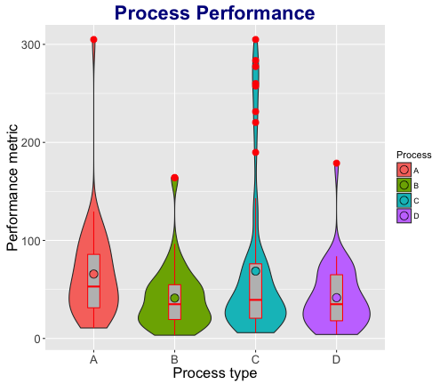
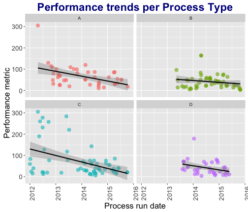

## Process Analysis App

### It will help you:

> - to get the overview of statistical parameters</li>
> - to transform the data</li>
> - to select time range</li>
> - to view the distribution and scatterplots</li>
> - to test for means equality</li>
> - to test for trend change over time</li>
> * Process Analysis App just does this. It helps to analyze and compare functionally equivalent processes.

--- .class #id &twocol

## Analyze data in two domains

*** =left
Poulation

*** =right
Time

--- .class #id 

## Review some selected statistics in a tabular form

<iframe src="example.html" STYLE="width:100%;height=100%"> </iframe>

The table is live, check it out!

--- .class #id 

## Where to find the stuff?

- [Process Analysis App](https://marioem.shinyapps.io/ProcessAnalysis/)
- [App code on GitHub](https://github.com/marioem/DevelopingDataProducts/tree/master)
- [Presentation code on GitHub]()

*A simple documentation about the app is embedded in the app itself*

